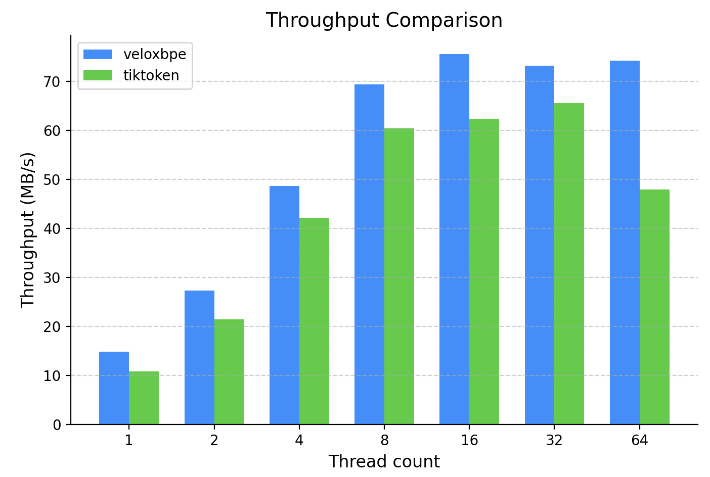

# Faster than OpenAI's Tiktoken

volexbpe is a low latency high throughput Byte-Pair encoding derived tokenizer providng exceptional performance & streamline interface.

## Built-In Supported Encodings
* o200k_base - used in o3, o1, gpt-4o.
* cl100k_base - used in gpt-4, gpt-3.5 turbo, gpt-3.5, most openai text embedding endpoints.
* r50k_base - majority decreptad.
* gpt-2 - gpt-2, open source

## Install
```sh
pip install veloxbpe
```

## Build & Install From Source
```sh
git clone https://github.com/friedhar/veloxbpe.git
maturin develop
```

## Benchmark 
> NOTE: Benchmarks are *hard*. there is > 0 chance one of the hundreds of factors were skewed, and thefore provided misleading results. benchmark code is open source and can be run on every machine.



## TODO - Possible Road Map
* Add support for custom BPE training.

